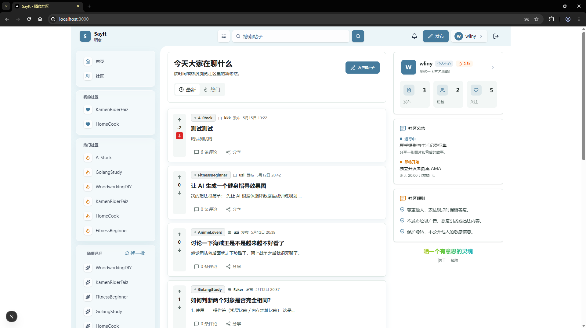
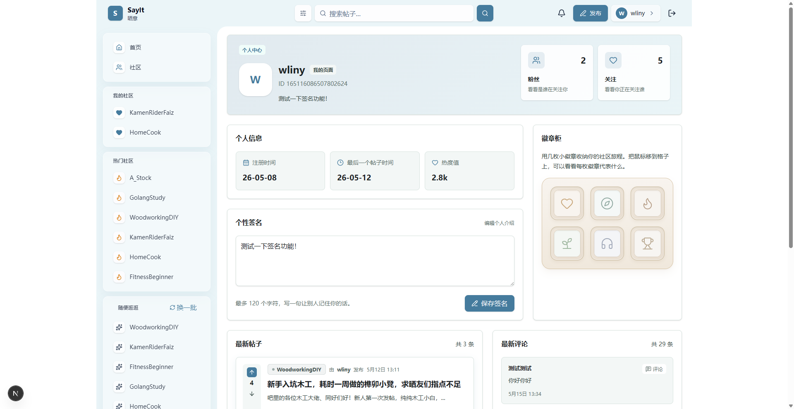
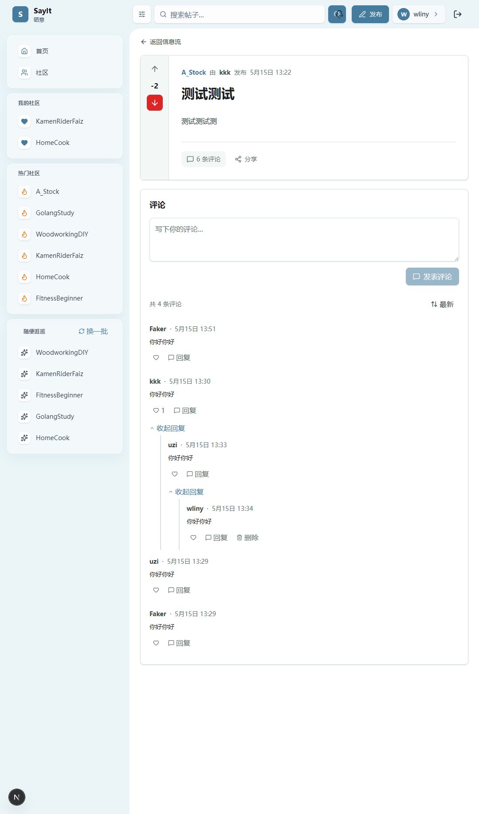
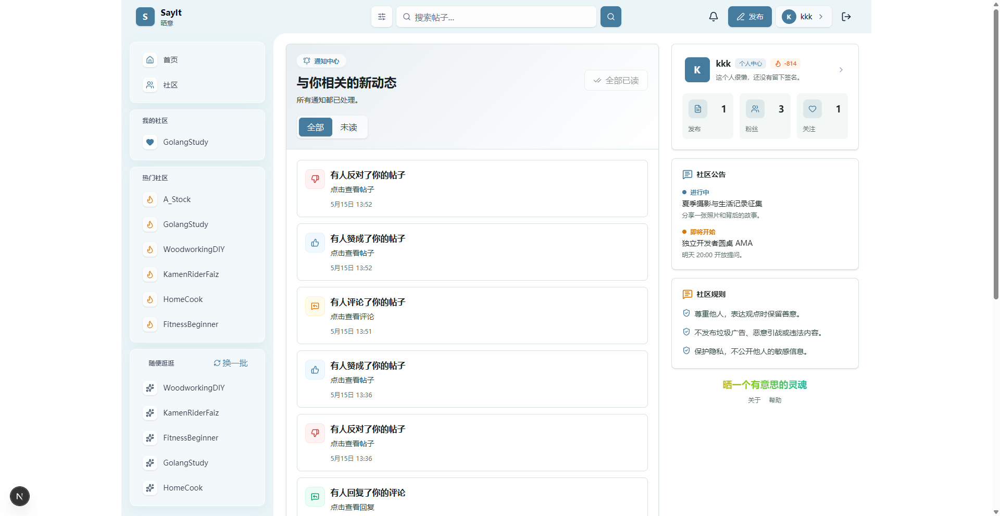
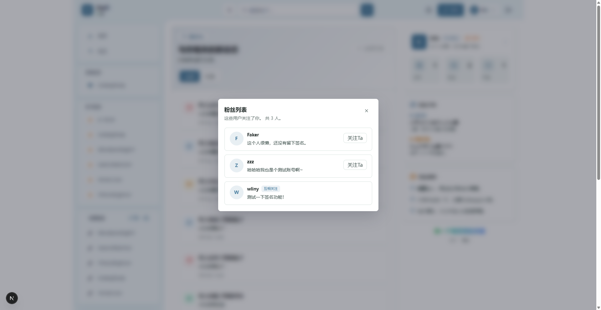
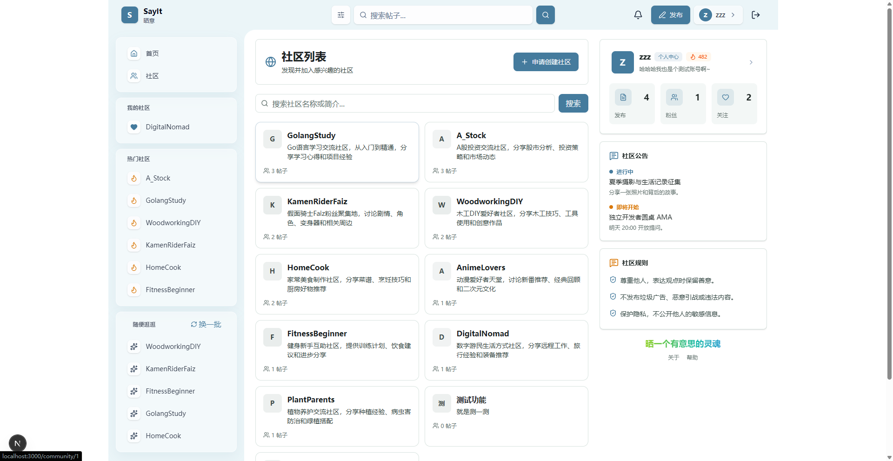

<div align="center">

<!-- logo -->

# Sayit

一个基于 Gin + MySQL + Redis + Next.js 的社区论坛项目，适合初学 Gin 但已经具备 Go、MySQL、Redis 基础的开发者，用来学习真实业务中的分层架构、异步通知、缓存设计和前后端协作。

[](https://go.dev/)
[](https://gin-gonic.com/)
[](https://www.mysql.com/)
[](https://redis.io/)
[](https://nextjs.org/)
[](LICENSE)
[](#getting-started)
[](https://github.com/namelyzz/sayit/releases)

</div>

## 目录

- [项目简述](#项目简述)
- [Features](#features)
- [开始](#开始)
- [Roadmap](#roadmap)
- [License](#license)
- [Contact](#contact)

## 项目简述

Sayit 是一个面向学习与实践的社区论坛系统。它并不是一个只展示单点能力的 demo，而是尽量还原真实业务中的典型后端和前端场景：

- 用户注册、登录、JWT 鉴权。
- 用户个人中心
- 社区浏览、帖子发布、帖子详情、帖子列表。
- 评论、回复、点赞、投票、关注。
- 基于 Redis 的缓存、排行、投票状态和通知队列。
- 基于 Redis Stream 的站内通知系统。
- 现代化前端通知中心、铃铛入口和未读红点。

对于刚开始接触 Gin 的开发者来说，Sayit 的价值在于：

- 这是一个 Gin 开发的初级项目，简单易懂，代码中带有注释，方便学习。
- 你可以看到一个实际项目如何做分层，而不是把所有逻辑堆在 handler 里。
- 你可以理解什么时候该用 MySQL，什么时候该用 Redis。
- 你可以学习如何通过 service 层组织复杂业务，并保持 controller 轻薄。
- 你可以看到一个完整通知系统如何设计：事件发布、异步消费、幂等写入、未读数缓存、前端展示。

如果你希望学习“如何把一个 Go Web 项目做得更像生产环境”，Sayit 会是一个很好的练习项目。

## Features

- 🔐 JWT 登录与鉴权
- 👤 用户注册、登录与个人主页
- 🏘️ 社区列表、社区详情、社区关注
- 📝 帖子发布、帖子详情、帖子列表
- 💬 评论、二级回复、评论树展示
- 👍 帖子赞成 / 反对 / 取消投票
- ❤️ 评论点赞 / 取消点赞
- 🔔 站内通知中心
- 📮 通知未读数、已读、全部已读
- 🧠 Redis Stream 异步通知消费
- ⚡ Redis 热度榜、投票状态缓存、评论缓存
- 🎨 Next.js 前端页面与铃铛入口
- 🧪 单元测试覆盖核心业务逻辑

## 项目预览

### 首页



社区帖子列表，支持按热度、时间排序，可进行搜索。

### 个人中心



用户个人主页，展示发布的帖子和评论，可查看粉丝列表和关注列表，支持编辑签名。

### 帖子详情



帖子完整内容，包含评论树、投票按钮、评论输入框。

### 通知中心



站内通知列表，显示未读/已读状态，支持单条已读和全部已读。

### 关注列表弹层



关注列表、发布信息、粉丝列表都以弹层的形式给出一个子页面，方便快速返回原本访问的页面。

#### 社区页面



展示所有社区，并支持搜索和创建（目前用户没有做分级，所有用户都能创建）

## 部分技术与设计细节

### 数据一致性保障：Outbox 补偿、乐观重试与对账机制

MySQL 与 Redis 双写场景下，直接操作存在部分失败导致数据不一致的风险；点赞计数等高频写入场景，缓存与数据库的同步也需要容错设计。

#### Outbox 补偿机制（帖子创建）

- **事务性写入**：帖子记录与 `outbox_events` 事件在同一个 MySQL 事务中原子写入，保证业务数据与事件记录的一致性。
- **同步+异步处理**：事务提交后立即尝试同步处理 Outbox 事件（写入 Redis 排行榜），失败则由后台 Worker 异步补偿。
- **后台补偿 Worker**：`StartOutboxWorker` 定时扫描 `next_retry_at <= now` 的待处理事件，批量消费并重试。
- **指数退避策略**：重试延迟按 `1s → 2s → 4s → ... → 60s` 指数增长，避免频繁重试加剧故障。
- **幂等删除**：事件处理成功后删除记录，失败则更新重试时间和错误信息。

#### 评论点赞的乐观重试

- **Redis 先行**：`SADD` 记录点赞状态，利用 Set 去重特性实现幂等；已点赞时直接返回 `ErrorLikeRepeated`。
- **MySQL 后写**：确认 Redis 成功后，使用 `gorm.Expr("like_count + 1")` 原子递增，失败时乐观重试 1 次。
- **容错降级**：MySQL 重试仍失败时只记日志不阻塞主流程，Redis 已记录状态，可通过后续对账修复。

#### 未读计数的缓存与回填

- **Redis 缓存**：未读数存储在 `sayit:notification:unread:<userID>`，使用 `INCR/DECR` 原子操作。
- **Lua 安全减计数**：`DecrNotificationUnread` 使用 Lua 脚本确保不会减成负数。
- **Read-Through 回填**：缓存未命中时从 MySQL `COUNT` 查询并回填 Redis，后续请求直接命中缓存。

#### 点赞数对账机制

- **定时任务**：`StartLikeCountReconciler` 每小时执行一次，修复 Redis 与 MySQL 的点赞数漂移。
- **游标分批**：使用 `comment_id` 游标分批获取评论，每批 1000 条，避免全表扫描。
- **并发处理**：5 个 goroutine 并行处理子批次，批量对比 `SCARD` 与 `like_count`。
- **批量修正**：找出不一致记录后，使用事务逐条更新 MySQL `like_count` 为 Redis 真实值。

#### 核心收益

- **数据最终一致性**：即使 Redis 暂时不可用，数据也不会丢失，后台任务自动补偿。
- **故障隔离**：缓存写入失败不影响主业务，降低系统耦合度。
- **可观测性**：`outbox_events` 表记录重试次数和错误信息，对账日志记录修复数量，便于排查问题。

---

### 业务中间件集成：配置、日志、鉴权与跨域

生产级 Web 应用需要统一的配置管理、结构化日志、身份认证和跨域处理，Sayit 通过 Gin 中间件链实现这些基础能力。

#### Viper 配置管理

- **热更新**：`viper.WatchConfig()` 配合 `fsnotify` 监听配置文件变化，运行时自动重载，无需重启服务。
- **结构体映射**：通过 `mapstructure` tag 将 YAML 配置反序列化到 `AppConfig` 结构体，类型安全。
- **分层配置**：MySQL、Redis、日志等配置独立嵌套，职责清晰。

#### Zap 结构化日志

- **高性能**：零内存分配的结构化日志库，生产环境使用 JSON 格式编码。
- **日志切割**：`lumberjack` 实现按文件大小、保留份数、保留天数自动切割。
- **多输出**：开发模式下同时写入文件（JSON 格式）和控制台（人类可读格式）。
- **Gin 集成**：`GinLogger` 记录请求状态码、耗时、UA 等信息；`GinRecovery` 捕获 panic 并记录堆栈。

#### JWT 鉴权

- **HS256 签名**：`utils/jwt/jwt.go` 实现 Token 创建与验证，1 小时过期。
- **中间件拦截**：`JWTAuthMiddleware` 从 `Authorization: Bearer <token>` 解析用户 ID，存入 `gin.Context`。
- **算法校验**：强制验证签名算法为 HMAC 系列，防止算法替换攻击。
- **路由分组**：公开接口（注册、登录、帖子列表）与需认证接口（发帖、投票、通知）通过 `v1.Use()` 分组。

#### CORS 跨域处理

- **预检请求**：`OPTIONS` 请求直接返回 `204 No Content`，不进入业务逻辑。
- **响应头设置**：`Access-Control-Allow-Origin`、`Access-Control-Allow-Headers`、`Access-Control-Allow-Methods` 等标准头。

#### 核心收益

- **开发体验**：配置热更新减少重启次数，结构化日志便于问题定位。
- **安全合规**：JWT 无状态鉴权，CORS 白名单控制访问来源。
- **生产就绪**：日志切割防止磁盘打满，panic 恢复防止服务崩溃。

---

### 业务安全防范：限流与防刷

高频写入接口（如评论、点赞）容易被恶意刷爆，Sayit 通过 Redis 实现限流和防刷双重防护。

#### 评论限流（GCRA 算法）

- **算法选择**：使用 `go-redis/redis_rate` 库实现 GCRA（Generic Cell Rate Algorithm），比令牌桶更平滑。
- **限流参数**：每用户每 10 秒最多 1 条评论，`Rate=1, Burst=1`，严格控制突发流量。
- **容错设计**：Redis 故障时限流检查直接放行，不影响正常用户使用。

#### 通知防刷（冷却门禁）

- **SetNX 实现**：`AcquireNotificationCooldown` 使用 `SETNX` 设置 12 小时 TTL 的冷却 Key。
- **Scope 设计**：`type:actor:recipient:target` 四元组组合，避免不同业务场景互相干扰。
- **自操作过滤**：自己评论自己、自己点赞自己、自己投票自己均不触发通知。

#### 核心收益

- **防刷保护**：避免恶意用户高频刷评论、刷通知，保护数据库和用户体验。
- **精细控制**：冷却 Key 按业务维度隔离，同一用户对不同帖子的点赞通知互不影响。
- **优雅降级**：Redis 故障时限流放行，优先保证可用性。

---

### 评论树设计：邻接表、懒加载与幂等删除

多级嵌套评论是社区论坛的核心交互，Sayit 采用邻接表 + 懒加载方案，在性能与功能间取得平衡。

#### 数据模型

- **邻接表**：`parent_id` 记录父评论 ID（0 表示顶级评论），`root_id` 记录根评论 ID（用于快速定位所属评论树）。
- **冗余字段**：`like_count` 反规范化存储点赞数，避免查询时关联 `comment_like` 表。

#### 懒加载策略

- **顶级评论优先**：首次加载只返回 `parent_id=0` 的顶级评论，按时间分页。
- **按需展开子评论**：点击"查看回复"时请求 `GET /comment/:id/children`，分页加载直接子评论。
- **批量统计**：`GROUP BY parent_id` 一次性获取多条评论的子评论数量，避免 N+1 查询。

#### 软删除与幂等

- **软删除**：`status=2` 标记删除，内容替换为 `[已删除]`，子评论保持不变继续展示。
- **幂等设计**：已删除评论重复删除时直接返回成功，前端无需区分"删除成功"和"已删除"。
- **权限校验**：帖子作者可删除任意评论，评论作者只能删除自己的评论。

#### 核心收益

- **性能优化**：懒加载避免一次性加载整棵评论树，减少数据库压力和网络传输。
- **用户体验**：子评论按需展开，页面加载速度快，交互流畅。
- **数据安全**：软删除保留数据完整性，幂等设计简化前端逻辑。

---

### 通知系统设计：Redis Stream 异步消费与幂等写入

站内通知涉及评论、点赞、投票、关注等多种场景，需要高吞吐、不丢失、不重复的异步处理能力。

#### 架构概览

- **生产者**：业务操作完成后，构建 `NotificationEvent` 写入 Redis Stream（`XADD`）。
- **消费者**：`StartNotificationWorker` 使用 `XREADGROUP` 批量消费，支持多实例水平扩展。
- **持久化**：消费成功后写入 MySQL `notifications` 表，并递增 Redis 未读计数。

#### Redis Stream 消息队列

- **Consumer Group**：`sayit:notification:group` 消费组，每条消息只被组内一个消费者处理。
- **消息确认**：`XACK` 确认后消息才会从 Pending List 移除，防止重复消费。
- **流长度控制**：`MaxLen=100000` 限制 Stream 长度，`Approx=true` 异步裁剪，避免内存溢出。

#### 幂等写入

- **DedupeKey**：`type:eventID` 组合唯一标识一条通知，MySQL 唯一索引保证幂等。
- **冷却门禁**：同一 `type:actor:recipient:target` 12 小时内不重复发送，避免刷屏。

#### 未读计数

- **Redis 原子计数**：`INCR/DECR` 操作未读数 Key，Lua 脚本防止减成负数。
- **Read-Through 回填**：缓存未命中时从 MySQL `COUNT` 查询并回填。

#### 核心收益

- **高吞吐**：Redis Stream 写入性能远高于直接写 MySQL，异步消费不阻塞主业务。
- **可靠投递**：Consumer Group + ACK 机制保证消息不丢失，幂等写入保证不重复。
- **水平扩展**：多 Worker 实例可并行消费，天然支持水平扩展。

---

### 投票系统设计：Redis 事务管道与原子计分

投票操作需要同时更新帖子热度分数和用户投票记录，高并发下存在数据竞争和状态不一致风险。

#### 数轴模型

投票方向用 `-1(反对) ← 0(无票) → 1(赞成)` 表示，支持三种操作：赞成（+1）、反对（-1）、取消（0）。

#### 分数计算

- **基础分值**：每票 432 分（约等于 7 天的秒数 / 100，便于热度衰减计算）。
- **计算公式**：`分数变化 = operate × diff × 432`
  - `operate`：方向系数（+1 加分 / -1 减分）
  - `diff`：票值差（普通投票=1，反向改票=2）
- **反向改票优化**：从赞成直接改为反对（或反之），差值为 2，分数变化 ±864，一步到位。

#### Redis 事务管道

- **TxPipeline**：原子执行两个操作——`ZIncrBy` 更新热度分数 + `ZAdd/ZRem` 更新投票记录。
- **投票记录**：每帖子独立 ZSet（`sayit:post:voted:<postID>`），Score 为投票方向，Member 为用户 ID。

#### 7 天投票窗口

- **时间校验**：通过 Redis 时间排行榜（`ZScore`）获取帖子创建时间，超过 7 天禁止投票。
- **防刷设计**：重复投票（新票值=旧票值）直接返回 `ErrorVoteRepeated`。

#### 核心收益

- **原子性保证**：事务管道确保分数和投票记录同步更新，避免中间状态。
- **高性能**：单次 Redis 事务完成所有操作，无锁竞争，吞吐量高。
- **状态可追溯**：支持查询用户当前投票状态，前端可实时展示投票高亮。

## 开始

### Prerequisites

请先准备以下环境：

| 依赖 | 推荐版本 | 说明 |
| --- | --- | --- |
| Go | 1.24.6 | 后端运行环境 |
| Node.js | 18+ | 前端运行环境 |
| MySQL | 8.x | 主数据存储 |
| Redis | 6.x / 7.x | 缓存、队列、未读数 |
| Git | Latest | 代码管理工具 |

### Installation

1. 克隆仓库。

```bash
git clone https://github.com/namelyzz/sayit.git
cd sayit
```

2. 初始化 MySQL 数据库。

```bash
mysql -u root -p sayit < models/sayit_tables.sql
```

3. 修改后端配置。

编辑 `config/config.yaml`，把以下内容改成你的本地环境：

- MySQL 地址、用户名、密码、数据库名。
- Redis 地址、端口、密码、DB。
- JWT / 密码哈希所需的 `secret`。

4. 启动后端。

```bash
go mod download
go run .
```

5. 启动前端。

```bash
cd frontend
npm install
```

创建或修改 `frontend/.env.local`：

```bash
NEXT_PUBLIC_API_URL=http://localhost:8082/api/v1
```

然后启动前端：

```bash
npm run dev
```

6. 打开浏览器。

- 前端地址通常是 `http://localhost:3000`
- 后端地址通常是 `http://localhost:8082`

## Roadmap

- [x] 用户注册、登录与 JWT 鉴权
- [x] 社区、帖子、评论、投票、关注功能
- [x] Redis 热度榜与投票状态缓存
- [x] Redis Stream 通知系统
- [x] 前端铃铛与通知中心
- [x] 通知未读数与已读状态
- [x] 通知冷却门禁与防刷策略
- [ ] 通知聚合，例如“3 人点赞了你的评论”
- [ ] Docker Compose 一键启动
- [ ] Swagger 文档


## License

本项目采用 MIT License 开源。

更多信息请查看 [LICENSE](LICENSE)。

---

如果这个项目对你有帮助，欢迎点个 Star ⭐

你的支持会让这个项目更完善，也会鼓励更多开源协作。
